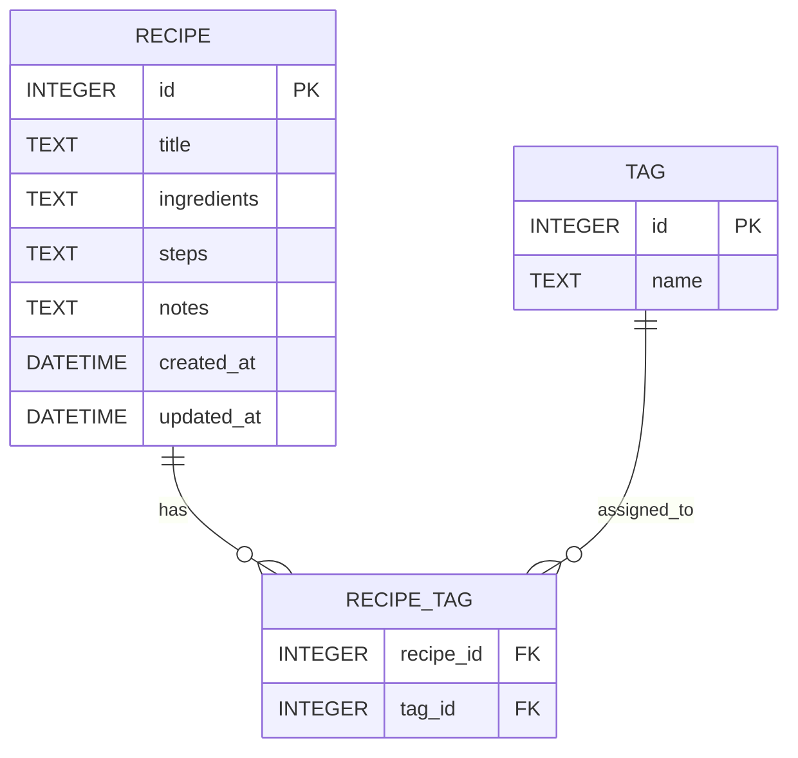

# 資料庫設計文件 (DB Design) - 食譜收藏夾系統

本文件基於 PRD 與 ARCHITECTURE，定義系統的 SQLite 資料庫 Schema、資料表關聯，以及 Python Model 的實作方式。

---

## 1. ER 圖 (實體關係圖)

本系統的核心實體為「食譜 (Recipe)」。為了支援未來的「多維度標籤」功能，我們設計了 `TAG` 與多對多關聯表 `RECIPE_TAG`。

---

## 2. 資料表詳細說明

### 2.1 `recipes` (食譜表)
儲存食譜的主要內容，將食材、步驟與心得獨立成不同欄位。

| 欄位名稱 | 型別 | 必填 | 說明 |
| :--- | :--- | :--- | :--- |
| `id` | INTEGER | 是 | Primary Key (自動遞增) |
| `title` | TEXT | 是 | 食譜名稱標題 |
| `ingredients` | TEXT | 否 | 食材清單 (可存入多行文字) |
| `steps` | TEXT | 否 | 烹飪步驟 (可存入多行文字) |
| `notes` | TEXT | 否 | 私房筆記 / 烹飪心得紀錄 |
| `created_at` | DATETIME | 是 | 建立時間 (預設 CURRENT_TIMESTAMP) |
| `updated_at` | DATETIME | 是 | 最後更新時間 (預設 CURRENT_TIMESTAMP) |

### 2.2 `tags` (標籤表)
預留給 Should Have 階段的多維度標籤系統。

| 欄位名稱 | 型別 | 必填 | 說明 |
| :--- | :--- | :--- | :--- |
| `id` | INTEGER | 是 | Primary Key (自動遞增) |
| `name` | TEXT | 是 | 標籤名稱 (如：減脂、15分鐘) |

### 2.3 `recipe_tags` (食譜標籤關聯表)
處理食譜與標籤之間的多對多關係。

| 欄位名稱 | 型別 | 必填 | 說明 |
| :--- | :--- | :--- | :--- |
| `recipe_id` | INTEGER | 是 | Foreign Key，關聯至 `recipes.id` |
| `tag_id` | INTEGER | 是 | Foreign Key，關聯至 `tags.id` |

---

## 3. SQL 建表語法

請參考專案中的 `database/schema.sql` 檔案。

---

## 4. Python Model 實作方針

為維持輕量化並減少依賴，本專案採用 Python 內建的 `sqlite3` 模組來實作 Model。
Model 類別將提供靜態方法 (Static Methods) 或類別方法 (Class Methods) 來執行 CRUD 操作，並回傳字典 (dict) 或物件以便於 Jinja2 渲染。

詳細實作請見 `app/models/recipe.py`。
