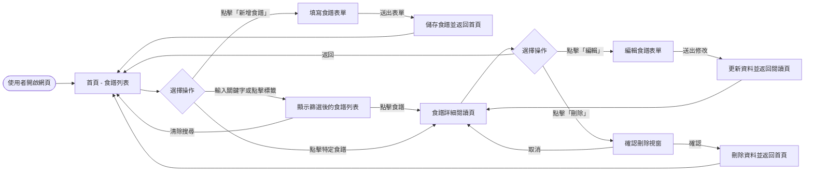
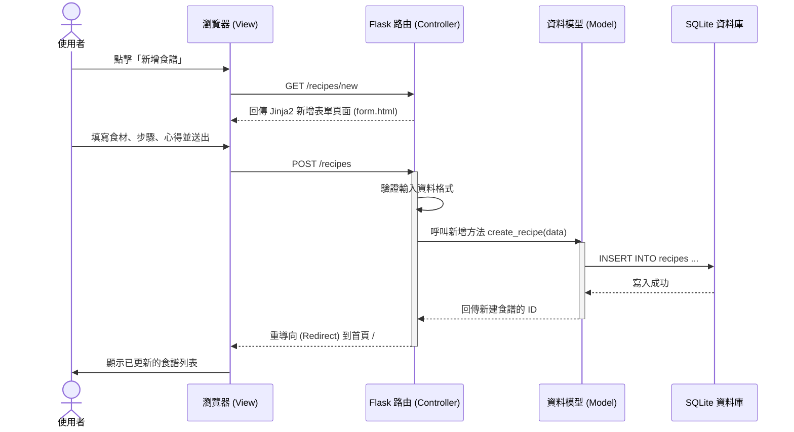

# 流程圖文件 (Flowchart) - 食譜收藏夾系統

本文件基於產品需求文件 (PRD) 與系統架構文件 (ARCHITECTURE)，規劃了使用者操作的路徑、系統資料流動的序列，以及各項功能的路由設計。

---

## 1. 使用者流程圖 (User Flow)

此流程圖展示了使用者在網站中瀏覽、新增、編輯與搜尋食譜的完整操作路徑。

---

## 2. 系統序列圖 (Sequence Diagram)

以下以「使用者新增食譜」的流程為例，展示前端瀏覽器、Flask 路由、資料模型與 SQLite 資料庫之間的資料互動與處理順序。

---

## 3. 功能清單對照表

根據 PRD 定義的 CRUD 與搜尋功能，以下是本專案預計實作的 URL 路徑與對應的 HTTP 方法規劃（考量 HTML 原生表單僅支援 GET/POST，因此更新與刪除皆採用 POST 搭配專屬路徑）。

| 功能名稱 | URL 路徑 | HTTP 方法 | 說明 |
| :--- | :--- | :--- | :--- |
| **瀏覽食譜列表 (首頁)** | `/` | `GET` | 顯示所有食譜，支援透過 `?q=關鍵字` 進行搜尋過濾 |
| **新增食譜 (表單頁)** | `/recipes/new` | `GET` | 渲染新增食譜的空白表單 |
| **新增食譜 (送出)** | `/recipes` | `POST` | 接收表單資料並寫入資料庫，完成後重導向至首頁 |
| **瀏覽食譜詳情** | `/recipes/<id>` | `GET` | 顯示特定食譜的詳細內容（食材、步驟、心得） |
| **編輯食譜 (表單頁)** | `/recipes/<id>/edit` | `GET` | 渲染編輯表單，並帶入該食譜的現有資料 |
| **編輯食譜 (送出)** | `/recipes/<id>/edit` | `POST` | 接收表單資料以更新資料庫，完成後重導向至詳情頁 |
| **刪除食譜** | `/recipes/<id>/delete` | `POST` | 從資料庫刪除指定食譜，完成後重導向至首頁 |
